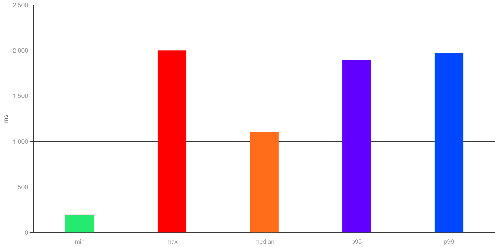
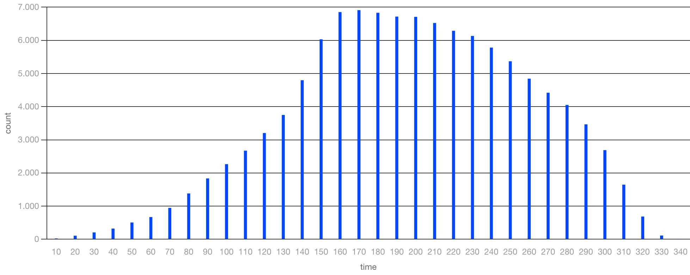

# Slowed Down JSON Server <!-- omit from toc -->

A slowed down version of a the [JSON Server](https://github.com/typicode/json-server) to simulate (randomly) slow requests




- [🚀Getting Started](#getting-started)
- [📈Load testing](#load-testing)

## 🚀Getting Started

Add your Data to the [server/db.json](server/db.json). The root keys will build your API Paths.

To start the server run the following commands:

```bash
# Install the dependencies
$ npm install

# Start the Server
$ npm start
```

You should see something like

> JSON Server is running on Port 3000

## 📈Load testing

To do a load test start the server (`npm start`) and run `npm run load-test`. Have a look at the resulting [report](reports/test-run-report.json.html).
